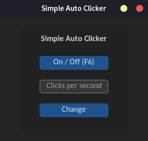

<h1 align="center"> 
<br/>
Simple-Auto-Clicker
</h1>

<p align="center"><b>A simple Auto-clicker designed for incremental games like Cookie Clicker written in Python.
</b></p>
<div align="center"></div>

## Backstory

The goal of this project was to gain knowledge in Python and tkinter and create an Auto-clicker that focuses solely on clicking, without added features such as cursor position. The project utilizes the UI library CustomTkinter for UI components and pynput for button functionality. Works on both Linux and Windows.

## Features:

- Toggle Key (F6) to start and stop the clicking
- Abillity to change the clicks per second

## Modules used:

- CustomTkinter
- pynput

## Install the modules with pip:

```{.bash}
pip3 install customtkinter pynput
```

## Build:

You can use tools like [PyInstaller](https://pyinstaller.org/en/stable/) to create an executable.
